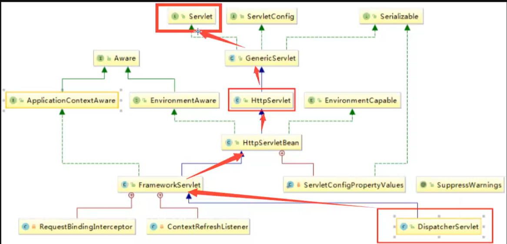
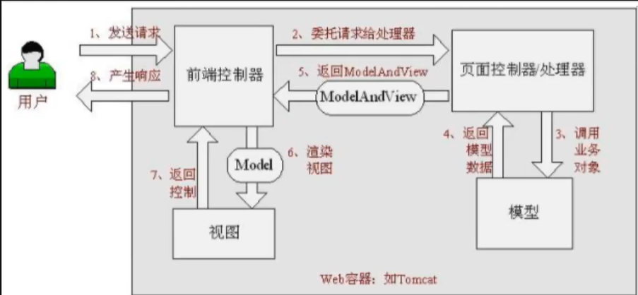
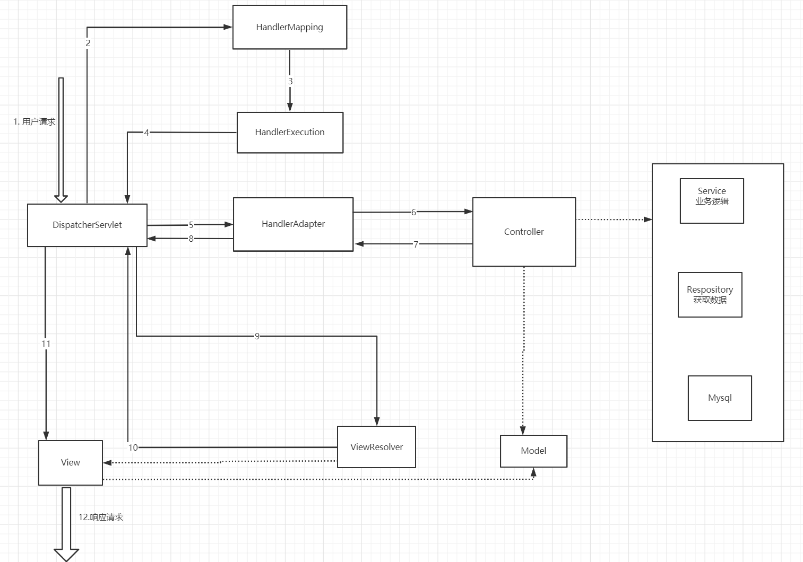

## 3.初识Spring mvc
Spring MVC是Spring Framework的一部分,是基于Java实现MVC的轻量级web框架.
#### 3.1 我们为什么要学习SpringMVC?
- 1.轻量级, 简单易学
- 2.高效, 基于请求和响应的MVC框架
- 3.与Spring兼容性好, 无缝结合
- 4.约定大于配置
- 5.功能强大:RESTful, 数据验证, 格式化, 本地化, 主题等等


Spring的web框架围绕DispatcherServlet设计
#### 3.2中心控制器
Spring的web框架围绕DispatcherServlet设计, DispatcherServlet的作用是将请求分发到不同的方法和类中. 
从Spring2.5开始,用户可以采用基于Controller声明方式.   

SpringMvc与其他MVC框架一样, 以请求为驱动,围绕一个中心Servlet分派请求及提供其他功能,DispatcherServlet是一个实际的
Servlet(它继承HTTPServlet)



#### 3.3先运行一个SpringMVC的web项目
1. 新建Module,添加web支持
2. 确定导入SpringMVC的依赖
3. 配置web.xml注册DispatcherServlet
```xml
<?xml version="1.0" encoding="UTF-8"?>
<web-app xmlns="http://xmlns.jcp.org/xml/ns/javaee"
         xmlns:xsi="http://www.w3.org/2001/XMLSchema-instance"
         xsi:schemaLocation="http://xmlns.jcp.org/xml/ns/javaee http://xmlns.jcp.org/xml/ns/javaee/web-app_4_0.xsd"
         version="4.0">

<!--1.注册DispatcherServlet-->
    <servlet>
        <servlet-name>springmvc</servlet-name>
        <servlet-class>org.springframework.web.servlet.DispatcherServlet</servlet-class>
<!--关联一个SpringMVC的配置文件,[servletName]-servlet.xml -->
        <init-param>
            <param-name>contextConfigLocation</param-name>
            <param-value>classpath:springmvc-servlet.xml</param-value>
        </init-param>
<!--        启动级别1-->
        <load-on-startup>1</load-on-startup>
    </servlet>
    <servlet-mapping>
        <servlet-name>springmvc</servlet-name>
        <url-pattern>/</url-pattern>
    </servlet-mapping>
</web-app>
```

4.编写SpringMVC的配置文件.名称为[ServletName]-servlet.xml, 这里的名字要求按照官方来.
```xml
<?xml version="1.0" encoding="UTF-8"?>
<beans xmlns="http://www.springframework.org/schema/beans"
       xmlns:xsi="http://www.w3.org/2001/XMLSchema-instance"
       xsi:schemaLocation="http://www.springframework.org/schema/beans
        https://www.springframework.org/schema/beans/spring-beans.xsd">
</beans>
```


5.添加处理器映射器
```xml
 <bean class="org.springframework.web.servlet.handler.BeanNameUrlHandlerMapping"/>
```
6.添加处理器适配器
```xml
    <bean class="org.springframework.web.servlet.mvc.SimpleControllerHandlerAdapter"/>
```
7.添加视图解析器
```xml
<bean class="org.springframework.web.servlet.view.InternalResourceViewResolver" id="InternalResourceViewResolver">
        <property name="prefix" value="/WEB-INF/jsp/"/>
        <property name="suffix" value=".jsp"/>
    </bean>
```

8.编写我们的Controller业务
```java
package com.kuang.controller;
import org.springframework.web.servlet.ModelAndView;
import org.springframework.web.servlet.mvc.Controller;

import javax.servlet.http.HttpServletRequest;
import javax.servlet.http.HttpServletResponse;

public class HelloController implements Controller {
    public ModelAndView handleRequest(HttpServletRequest httpServletRequest, HttpServletResponse httpServletResponse) throws Exception {
        ModelAndView mv = new ModelAndView();
       mv.addObject("msg","HelloSpringMVC");
       mv.setViewName("hello");
       return mv;
    }
}

```

9.将自己的类交给SpringIOC容器, 注册bean
```xml
 <bean id="/hello" class="com.kuang.controller.HelloController"/>
```
10.写一个要跳转的jsp页面,显示ModelAndView存放的数据, 以及我们的正常页面
```jsp
<%@ page contentType="text/html;charset=UTF-8" language="java" %>
<html>
<head>
    <title>Title</title>
</head>
<body>
${msg}
</body>
</html>
```
可能遇到的问题:访问出现404  
- 在IDEA项目中添加lib

#### 3.4 SpringMvc的执行原理

下图就是Spring mvc一个较为完整的流程图, 实线表示SpringMvc框架提供的技术,
不需要开发者实际开发实现, 四个虚线部分需要我们实现

下面我们对这个图详细的分析一下  
1. DispatcherServlet表示前置控制器,是整个SpringMVC的核心, 用户发送请求, DispatcherServlet接受请求并拦截请求.
    - 我们假设请求的url为:http://localhost:8080/SpringMVC/hello
    - Url可以看做三个部 
        - http://localhost:8080域名服务器
        - SpringMVC部署在服务器上的web站点
        - hello表示控制器
    - url表示为:请求服务器上的SpringMVC站点下的hello控制器.
2. HandlerMapper为处理器映射器,DispatcherServlet自行调用. HandlerMapping根据请求url查找Handler
3. HandlerExecution表示具体的Handler, 其主要作用是根据url查找控制器,如上url被查找的控制器为:hello
4. HandlerExecution将解析后的信息传递给DispatcherServlet, 如解析控制映射器
5. HandlerAdapter表示处理适配器,其按照特定的规则去执行Handler
6. Handler让具体的Controller去执行
7. Controller将具体的信息返回给HandlerAdapter, 如ModelAndView.
8. HandlerAdapter将视图逻辑名或模型传递给DispatcherServlet
9. DispatcherServlet调用视图解析器(ViewResolver)来解析HandlerAdapter传递的逻辑视图名.
10. 视图解析器将解析后的逻辑视图名传给DispatcherServlet
11. DispatcherServlet根据视图解析器解析视图的结果, 调用具体的视图
12. 最终视图呈现给用户
