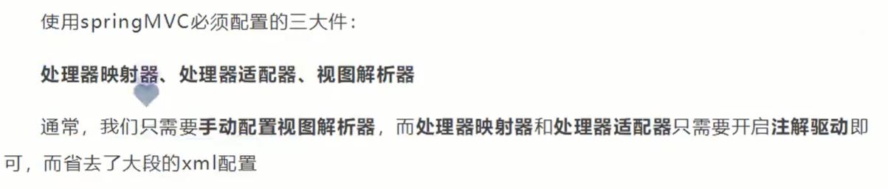

## 4.使用注解的方式SpringMVC
#### 4.1. 创建Model项目, 右键标记为web4.0项目
#### 4.2. 配置web.xml
```xml
<?xml version="1.0" encoding="UTF-8"?>
<web-app xmlns="http://xmlns.jcp.org/xml/ns/javaee"
         xmlns:xsi="http://www.w3.org/2001/XMLSchema-instance"
         xsi:schemaLocation="http://xmlns.jcp.org/xml/ns/javaee http://xmlns.jcp.org/xml/ns/javaee/web-app_4_0.xsd"
         version="4.0">

    <!--1.注册DispatcherServlet-->
    <servlet>
        <servlet-name>springmvc</servlet-name>
        <servlet-class>org.springframework.web.servlet.DispatcherServlet</servlet-class>
        <!--关联一个SpringMVC的配置文件,[servletName]-servlet.xml -->
        <init-param>
            <param-name>contextConfigLocation</param-name>
            <param-value>classpath:springmvc-servlet.xml</param-value>
        </init-param>
        <!--        启动级别1-->
        <load-on-startup>1</load-on-startup>
    </servlet>
    <servlet-mapping>
        <servlet-name>springmvc</servlet-name>
        <url-pattern>/</url-pattern>
    </servlet-mapping>
</web-app>
``` 
#### 4.3添加SpringMVC配置文件
- 让IOC注解生效
- 静态资源过滤,HTML,CSS,JS,图片,视频....
- MVC注解驱动
- 配置视图解析器
```xml
<?xml version="1.0" encoding="UTF-8"?>
<beans xmlns="http://www.springframework.org/schema/beans"
       xmlns:xsi="http://www.w3.org/2001/XMLSchema-instance"
       xmlns:p="http://www.springframework.org/schema/p"
       xmlns:context="http://www.springframework.org/schema/context"
       xmlns:mvc="http://www.springframework.org/schema/mvc"
       xmlns:task="http://www.springframework.org/schema/task"
       xsi:schemaLocation="
        http://www.springframework.org/schema/beans
        http://www.springframework.org/schema/beans/spring-beans.xsd
        http://www.springframework.org/schema/context
        http://www.springframework.org/schema/context/spring-context.xsd
        http://www.springframework.org/schema/mvc
        http://www.springframework.org/schema/mvc/spring-mvc.xsd
        http://www.springframework.org/schema/task
        http://www.springframework.org/schema/task/spring-task.xsd">

<!--    自动扫描包, 让指定包下的注解生效,由IOC容器统一管理-->
    <context:component-scan base-package="com.kuang.controller"/>

<!--    让Springmvc不处理静态资源-->
    <mvc:default-servlet-handler/>


<!--
    支持mvc注解驱动
        在Spring中一般采用@RequestMapping注解来完成映射关系
        要想使@RequestMapping注解生效, 必须向上下文中注册DefaultAnnotationHandlerMapping和一个AnnotationMethodHandlerAdapter实例
        这两个实例分别在类级别和方法级别处理.

        而annotation-driver配置帮助我们自动完成上述两个实例的注入
-->
    <mvc:annotation-driven/>

<!--视图解析器-->
    <bean class="org.springframework.web.servlet.view.InternalResourceViewResolver" id="internalResourceViewResolver">
        <property name="prefix" value="/WEB-INF/jsp/"/>
        <property name="suffix" value=".jsp"/>
    </bean>

</beans>
```

在视图解析器中,我们把所有视图都放在/WEB-INF/目录下,这样可以保证视图安全,因为这个目录下的文件,客户端不能直接访问
#### 4.4 创建Controller
```java
package com.kuang.controller;

import org.springframework.stereotype.Controller;
import org.springframework.ui.Model;
import org.springframework.web.bind.annotation.RequestMapping;

@Controller
@RequestMapping("helloController")
public class HelloController {


    //真实的访问地址:项目名/helloController/hello
    @RequestMapping("/hello")
    public String hello(Model model){
        /*
        封装数据
        向模型中添加属性msg与值,可以在jsp页面中取出并渲染
         */
        model.addAttribute("msg", "Hello, SpringMVC");

        // WEB-INF/jsp/hello.jsp
        return "hello"; // 这个返回结果, 会被视图解析器处理
    }
}
```
- @Controller是为了让Spring IOC容器初始化时自动扫描到
- @RequestMapping是为了映射请求路径
- 方法中声明Model类型的参数是为了把Action中的数据带到视图中

#### 总结
