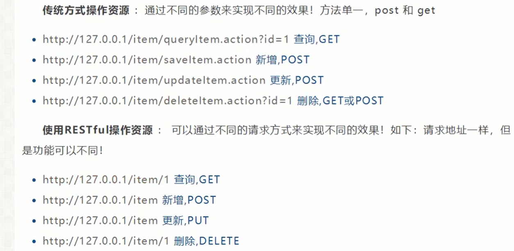
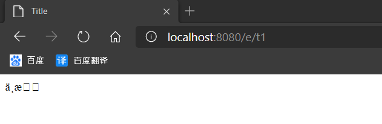

##5.一些注解说明
#### 5.1 Controller
下面四个是一样的, 只是在不同的地方用的时候,就用不同的注解  
@Component  组件      
@Controller  controller  
@Service    service  
@Repository   dao

---
@Controller代表这个类会被Spring接管,被这个注解的类中的所有方法, 如果返回值为String, 并且有具体的页面可以
跳转,那么就会被视图解析器解析.

#### 5.2 @RequestMapping
@RequestMapping用于映射到控制器或一个特定的处理程序方法. 用于类或方法上.


#### 5.3 Restful风格
#### 概念
Restful就是一种资源定位及资源操作风格, 不是标准也不是协议, 只是一种风格, 基于这个风格设计的软件可以更简洁, 更有层次, 
易于实现缓存等机制



#### 5.4 Spring MVC的转发与重定向
设置ModelAndView对象,根据view的名称和视图解析器跳转到指定页面. 
```xml
<bean class="org.springframework.web.servlet.view.InternalResourceViewResolver" id="internalResourceViewResolver">
        <property name="prefix" value="/WEB-INF/jsp/"/>
        <property name="suffix" value=".jsp"/>
    </bean>
```
对应的Controller
```java
public class ControllerTest1 implements Controller {
    public ModelAndView handleRequest(HttpServletRequest httpServletRequest, HttpServletResponse httpServletResponse) throws Exception {

        ModelAndView mv = new ModelAndView();
        mv.addObject("msg","ControllerHello");
        mv.setViewName("test");
        return mv;
    }
}

@Controller
public class ControllerTest2 {
    @RequestMapping("/t2")
    public String test1(Model model){
        model.addAttribute("msg","ControllerTest2");
        return "test";
    }
}

```
显示的加一个redirect实现重定向.  
记住转发与重定向的区别, 转发地址栏不会改变,而重定向地址栏会改变.  
```java

@Controller
public class ControllerTest2 {
    @RequestMapping("/t2")
    public String test1(Model model){
        model.addAttribute("msg","ControllerTest2");
        return "redirect:/index.jsp";
    }
}

```

#### 5.5 接受请求参数
一. 提交的域名称与处理方法的参数名一样   
提交: http://localhost:8080/hello?name=wuhan  
处理方法:
```java
@RequestMapping("/hello")
    public String hello(String name){
        System.out.println(name);
        return "hello";
    }
```


二. 提交的域名称与处理方法的参数名不一样   
提交: http://localhost:8080/hello?username=wuhan  
```java
 @RequestMapping("/hello")
    public String hello(@RequestParam("username") String name){
        System.out.println(name);
        return "hello";
    }
```
三. 前端提交一个对象  
需要提交的表单域和对象的属性名一致, 参数使用对象即可.  

实体类
```java
public class User {
    private int id;
    private String name;
    private int age;
} 
```

提交数据 :http://localhost:8080/mvc04/user?name=wuhan&id=1&age=18  

处理方法
```java
/*
    1. 接受前端用户传递的参数, 判断参数的名字, 假设名字直接在方法上, 可以直接使用
    2. 假设, 传递的是一个User对象, 它会匹配User对象的字段名, 如果名字一致就OK. 否则匹配不到返回null.

     */
    @RequestMapping("t2")
    public String test2(User user){
        System.out.println(user);
        return "test";
    }
```  

#### 5.5 数据回显到前端
一. ModelAndView  
在储存数据的同时, 可以进行设置返回的逻辑视图, 进行控制展示层的跳转. 
```java
public class ControllerTest1 implements Controller {
    public ModelAndView handleRequest(HttpServletRequest httpServletRequest, HttpServletResponse httpServletResponse) throws Exception {

        ModelAndView mv = new ModelAndView();
        mv.addObject("msg","ControllerHello");
        mv.setViewName("test");
        return mv;
    }
}
```
二. Model  
只提供寥寥几个方法,只适合于储存数据, 简化了新手对model对象的操作与理解
```java
@RequestMapping("/t1")
    public String test1(@RequestParam("username") String name, Model model){
        // 1, 接受前端的参数
        System.out.println(name);
        // 2. 将返回的结果返回给前端
        model.addAttribute("msg",name);

        // 3, 跳转视图
        return "test";
    }
```
三. ModelMap   
继承了LinkedMap除了实现了自身的一些方法, 同时还继承了LinkedMap的方法与特性

#### 5.6 处理中文乱码问题
提交一个表单  
```jsp
<form action="/e/t1" method="post">
    <input type="text" name="name">
    <input type="submit">
</form>
```
Contronller
```java
@Controller
public class EncodingController {
    @PostMapping("/e/t1")
    public String test1(String name, Model model){
        model.addAttribute("msg",name);
        return "test";
    }
}

```
最后得到中文乱码


过滤器解决乱码问题  
第一种情况
```java
package com.kuang.filter;


import javax.servlet.*;
import java.io.IOException;

public class EncodingFilter implements Filter {
    public void init(FilterConfig filterConfig) throws ServletException {

    }

    public void doFilter(ServletRequest servletRequest, ServletResponse servletResponse, FilterChain filterChain) throws IOException, ServletException {
        servletRequest.setCharacterEncoding("utf-8");
        servletResponse.setCharacterEncoding("utf-8");
        filterChain.doFilter(servletRequest,servletResponse);
    }

    public void destroy() {

    }
}

```
```xml
    <filter>
        <filter-name>encoding</filter-name>
        <filter-class>com.kuang.filter.EncodingFilter</filter-class>
    </filter>
    <filter-mapping>
        <filter-name>encoding</filter-name>
        <url-pattern>/</url-pattern>
    </filter-mapping>

```
乱码没有解决  
如果post改为get就把中文乱码问题解决了.  
```xml
    <filter>
        <filter-name>encoding</filter-name>
        <filter-class>com.kuang.filter.EncodingFilter</filter-class>
    </filter>
    <filter-mapping>
        <filter-name>encoding</filter-name>
        <url-pattern>/*</url-pattern>
    </filter-mapping>
```
** 把通配符改为/*也能解决中文乱码问题  **

1.
/**的意思是所有文件夹及里面的子文件夹  
/*是所有文件夹，不含子文件夹  
/是web项目的根目录  

2.当url-pattern配置成/*的时候，Tomcat会将所有的请求交给对应的Servlet进行处理，当url-pattern配置成/的时候，多数情况下与/效果一致，但是，当访问的路径正好对应jsp文件时，Tomcat会访问真实的jsp文件而不是把请求交给对应的Servlet处理。  

3.项目配置spring的servlet配置成/*会导致死循环，堆栈溢出。  
web.xml中filter和servlet都会用到url-pattern标签。其中filter可以用/*并且我们经常都是这么配的，但是servlet不能用/*（当然，不能说完全不能用）。  
servlet使用/*会覆盖其他所有的servlet，包括web容器中预定义的（比如tomcat预定义用来处理jsp的servlet）。此刻servlet覆盖了默认的jsp处理器，servlet又将页面渲染转交给默认的jsp处理器，于是自己调自己，死循环。  
servlet使用/就不会有这个问题，此种配法不会覆盖所有servlet，只会覆盖默认servlet（default servlet）。默认servlet的作用就是处理其他servlet不处理的东西， 如果其他servlet处理了就不会到它这里。  
再说filter，filter使用/*即为最强的全部匹配，使用/则只能匹配/这一个路径。由于filter的使用方式是链式调用，所以所有匹配到的都会被调用，不存在覆盖一说，只有顺序需要考虑。  

4.
<url-pattern>/</url-pattern>：  
会匹配到/springmvc这样的路径型url，不会匹配到模式为*.jsp这样的后缀型url。  

<url-pattern>/*</url-pattern>：
会匹配所有的url：路径型的和后缀型的url(包括/springmvc，.jsp，.js和.html等)。  
 
 
第二种方法:用springMVC的乱码过滤器就能解决,推荐使用第二种
```xml
    <filter>
        <filter-name>encoding</filter-name>
        <filter-class>org.springframework.web.filter.CharacterEncodingFilter</filter-class>
    </filter>
    <filter-mapping>
        <filter-name>encoding</filter-name>
        <url-pattern>/</url-pattern>
    </filter-mapping>

```
其他可能的问题  
Tomcat的编码设置 E:\apache-tomcat-9.0.37\conf\server.xml  
```xml
    <Connector port="8080" protocol="HTTP/1.1"
               connectionTimeout="20000"
               redirectPort="8443" 
               URLEncoding="UTF-8"/>
```

