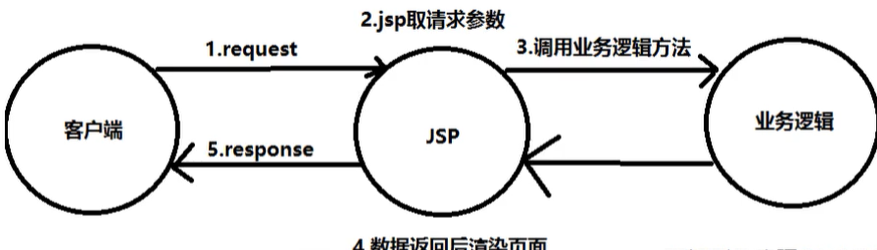
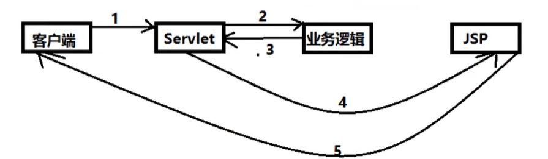

## 1.Spring mvc本章学习总览
JavaSE:基础  
JavaWeb  
SSM框架: 研究官方文档, 锻炼自学能力, 锻炼笔记能力, 锻炼项目能力  
**Spring MVC的执行流程**  
SSM框架的整合
#### 1.1回顾MVC
- MVC是将数据, 业务逻辑, 显示 三者分离, 的一种软件设计规范.
- 记的我们上面做的项目中, dao层是与数据库打交道, service是处理业务它调用dao层, servlet是调用service响应jsp/html页面.
    - Model模型:dao,service. 数据模型,提供要展示的数据, 因此包含数据和行为,可以认为是领域模型或JavaBean组件. 现在一般都分离出来:
Value Object(数据Dao) 和服务层(行为Service). 也就是模型提供了模型数据查询和模型数据的状态更新等功能, 包括数据与业务.  
    - View视图:jsp  负责进行模型展示,一般是我们所见到的用户界面.
    - Controller控制器:servlet 接受用户请求, 委托给模型进行处理,处理完毕后把返回的模型数据返回给视图, 由视图负责展示. 也就是说控制器做了
一个调度员的工作.

####1.2 model1时代
主要就分为两层, 视图层和模型层

#### 1.3 model2时代
将项目分为MVC三层架构
 

1. 用户发送请求  
2. Servlet接受请求数据,并调用对应的业务逻辑方法  
3. 业务处理完毕,返回更新后的数据给servlet
4. servlet转向JSP, 由JSP来渲染页面  
5. 响应给前端更新后的页面

职责分明  
Controller
- 1.获取表单数据
- 2.调用业务逻辑
- 3.转向指定的页面

Model
- 1.业务逻辑
- 2.保存数据状态

view
- 1.显示页面


下面是maven项目存在静态资源过滤问题

```xml
 <build>
            <resources>
                <resource>
                    <directory>src/main/java</directory>
                    <includes>
                <include>**/*.properties</include>
                  <include>**/*.xml</include>
                </includes>
              <filtering>false</filtering>
            </resource>
          <resource>
              <directory>src/main/resources</directory>
              <includes>
                  <include>**/*.properties</include>
                  <include>**/*.xml</include>
              </includes>
              <filtering>false</filtering>
          </resource>
      </resources>
</build>
```


